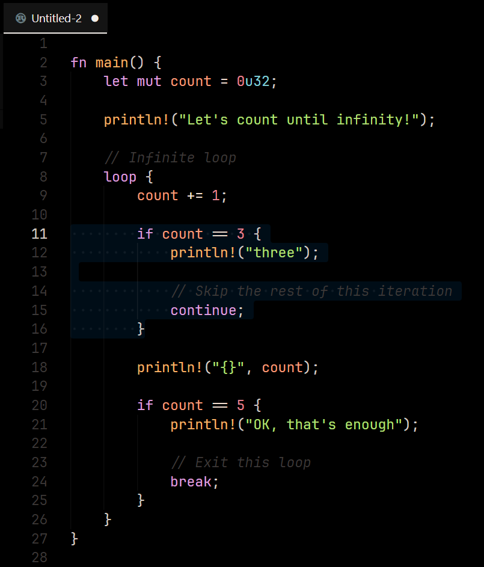

# soft-in-black README
A VSCode theme based with a pitch-black setting but with cozy colors.

### What it looks like

*Example code taken from [Rust By Example (8.2: `loop`)](https://doc.rust-lang.org/rust-by-example/flow_control/loop.html).*

### Contribution
All welcome.